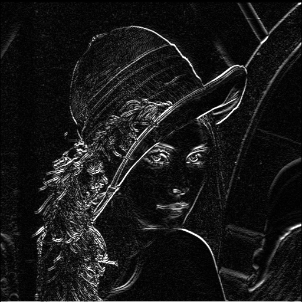

# Concurrent Convolution Project

## Overview

This project focuses on optimizing operating system efficiency through concurrent convolution techniques. The goal is to implement and explore various concepts, such as threads, processes, multitasking, pointers, and scheduling, to enhance the performance of convolution operations in image processing tasks.

## Key Objectives

- Implement concurrent convolution algorithms.
- Explore the use of threads and processes for parallel execution.
- Investigate multitasking and scheduling strategies to maximize system resources.
- Leverage pointers and efficient memory management techniques.
- Measure and analyze the performance improvements achieved through these optimizations.

## Getting Started

### Prerequisites

- Linux kernel >=2.6 or compatible with thread affinity
- Library libc6-dev


### Compilation

1. **Build the Executable**:
   To compile the program and generate the executable file, run the following command in the terminal:

    ```$ make```

### Running the Program

2. **Execute the Program**:
Once compiled, you can run the program using the command:

    ```$ ./image_processor```
3. **Input Images and Filters**:
After starting the program, you will be prompted to enter the names of the images (in `.pgm` format) and the filters you wish to apply to each image. The available filters are `sobel`, `blur`, and `sharpen`.

    ``` 
    ========  Image Processor Program  ========
    Enter image filename ('quit' to exit): lenna.pgm  
    Enter filter type (sobel, blur, sharpen): sobel
    Enter image filename ('quit' to exit): pepper.pgm
    Enter filter type (sobel, blur, sharpen): sobel
    Enter image filename ('quit' to exit): pato.pgm
    Enter filter type (sobel, blur, sharpen): blur
    Enter image filename ('quit' to exit): tank.pgm
    Enter filter type (sobel, blur, sharpen): sobel
    Enter image filename ('quit' to exit): quit ```
4. **Output Files**:
The processed images will be generated in the same folder as the executable. The output files will follow the format `<filename>_<filter_applied>_result.pgm` Ejm:.
    #### Original Image (lenna.pgm)
    

    #### Sobel Filtered Image (lenna_sobel_result.pgm)
    

## Author

Santiago Tumbaco

